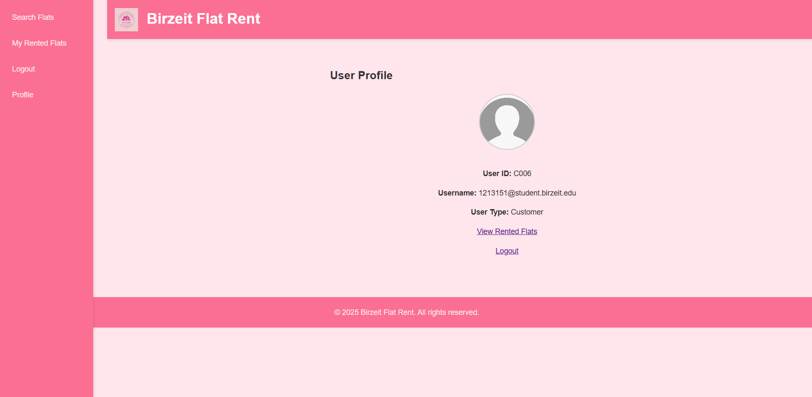

# Birzeit Flat Rent Website

## Project Overview

This repository contains the full-stack implementation of the 'Birzeit Flat Rent' website, a comprehensive platform designed for flat searching, renting, and management. Developed as an individual project during a web development course, this application showcases both front-end and back-end development skills. The project was completed within approximately three days of on-and-off work, demonstrating rapid prototyping and development capabilities.

The Project had no restriction for the main color palette so you would notice a unique and creative color palette, notably incorporating pinkish tones (my favourite color). It caters to three distinct user types: Regular Customers, Flat Owners, and Managers, each with tailored functionalities to ensure a seamless and secure experience.

The course Project specified that every deliverable must be a PHP file that contains the page’s HTML inline. For that reason you’ll see mostly .php files in this repo — but those files contain the actual HTML pages (templated and mixed with PHP logic) rather than separate .html files. This structure was used to meet the assignment requirements while keeping each page self-contained.

## Features

### General / Public Access Features

Users without an account can still browse available flats and view detailed information about each listing. However, certain interactive features, such as requesting appointments or initiating rental processes, are restricted to registered users, prompting them to log in or register when attempting such actions.

### Customer Features

Registered customers have access to a wide range of functionalities designed to facilitate their flat search and rental journey:

- **Three-Step Registration**: A secure and streamlined registration process ensures user data integrity.
- **Flat Search and Filtering**: Customers can efficiently search for flats based on various criteria.
- **Appointment Request**: Ability to request viewing appointments for flats of interest.
- **Flat Rental Process**: A multi-step procedure to rent flats directly through the website.
- **Personalized Profile**: Access and manage their personal profile information.
- **About Us Page**: View information about the platform.

### Owner Features

Flat owners can leverage the platform to list their properties and manage rental inquiries:

- **Offer Flat**: Owners can submit new flat listings to the website. These submissions are sent as requests to the manager for approval or rejection.
- **Messaging System**: Owners receive messages regarding viewing appointment requests and successful flat rentals.
- **Secure Registration**: Owners undergo a multi-step registration process, which includes providing credit information for verification purposes.

### Manager Features

The manager role is central to the platform's operation, overseeing flat listings and user interactions:

- **Inquire Flat Screen**: Managers have a dedicated interface to review and manage flat offers submitted by owners.
- **Flat Search**: Like other users, managers can also search and view flat listings.
- **Message Management**: Managers receive and process messages from owners, primarily related to flat offer approvals or rejections.
- **Approval/Rejection System**: Managers can accept or reject flat offers, controlling the inventory of available properties on the website.

## Screenshots

Here are some screenshots illustrating the various features and user interfaces of the Birzeit Flat Rent website.

### General / Public Access

#### Main Page

#### Main Page with Search

#### About Us Page

#### Flat Information Page

#### Flat Rent Attempt by Non-User

### Customer User Interface

#### Customer Login

#### Customer Main Dashboard

#### Customer Profile

#### Customer Viewing Appointment Request

#### Customer Flat Rental Process - Step 1

#### Customer Flat Rental Process - Step 2

#### Customer Flat Rental Process - Step 3

#### Customer Flat Rental Process - Step 4

#### Customer Flat Rental Process - Final Confirmation

#### Customer Registration - Step 1

#### Customer Registration - Step 2

#### Customer Registration - Step 3

#### Customer Registration - Step 4

#### Customer Registration - Final Step

### Owner User Interface

#### Owner Flat Offer - Step 1

#### Owner Flat Offer - Step 2

#### Owner Flat Offer - Step 3

#### Owner Flat Offer - Step 4

#### Owner Flat Offer - Step 5

#### Owner Messages

### Manager User Interface

#### Manager Flat Offers 

